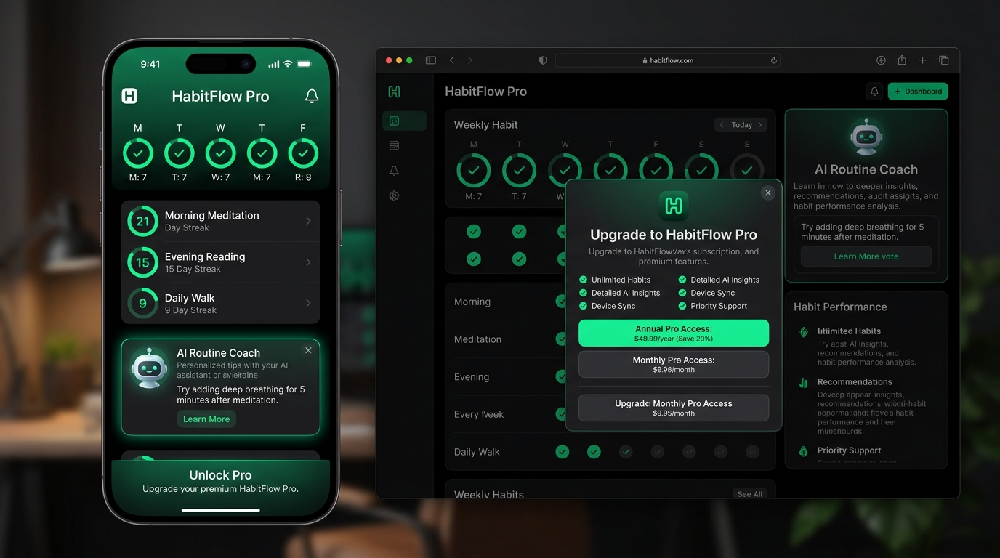

# 📱 HabitFlow Pro — Pitch Deck & Executive Summary
**Adaptive AI Habit & Flow Coach with RevenueCat Monetization**  
*Built for the RevenueCat Ship-a-thon 2026 on Devpost*



---

## Slide 1: Cover & Vision
* **Product:** HabitFlow Pro
* **Tagline:** Build atomic habits that actually stick with personalized AI routine coaching, burnout prevention, and seamless RevenueCat monetization.
* **Core Technology:** RevenueCat Paywalls v2 + In-App Customer Center + Adaptive AI Coaching
* **Live Demo:** [GitHub Repository](https://github.com/akmalkhaniub/habitflow-pro)

---

## Slide 2: The Problem (The Habit Failure Trap)
* **92% Failure Rate:** Over 90% of New Year's resolutions and self-improvement habits collapse within 3 weeks.
* **One-Size-Fits-All Rigidity:** Traditional habit apps punish users for missed days, destroying momentum and causing guilt-driven churn.
* **Monetization Blindness:** Indie developers struggle with high churn, failed paywall conversions, and lack of self-service cancellation retention tools.

---

## Slide 3: The Solution — Adaptive Habit Stacking + AI Coach
HabitFlow Pro combines behavioral science with modern monetization:

1. **Adaptive Habit Stacking & Streak Protection:**
   * Context-aware habit sequencing (e.g., Morning Coffee -> 10m Deep Breathing -> 90m Focus Block).
   * Smart streak grace periods to eliminate shame-driven app abandonment.

2. **Adaptive AI Routine Coach:**
   * Analyzes completion friction, timing patterns, and category balance.
   * Generates actionable daily micro-adjustments to keep users in "Flow".

3. **RevenueCat 2026 Monetization Architecture:**
   * Dynamic Paywalls v2 with real-time countdown timers, interactive comparison sliders, and exit offers.
   * Self-service In-App Customer Center (plan changes, retention surveys, pause subscription).
   * React Native Web Billing fallback powered by Stripe checkout.

---

## Slide 4: RevenueCat Architecture & Subscription Tiers
```
[ User Action / Streak Milestones ]
               │
               ▼
[ RevenueCat Gating Engine ] ──( 3-Habit Limit & AI Coach Check )
               │
      ┌────────┴────────┐
      ▼                 ▼
[ FREE USER ]     [ PRO SUBSCRIBER (Active Entitlement: "pro_access") ]
• Max 3 habits    • Unlimited Atomic Habits
• Standard stats  • Personalized AI Routine Coach & Burnout Shield
• Basic streaks   • RevenueCat Customer Center Self-Service
                  • Cloud Sync across iOS, Android, and Web
```

### Product Catalog:
* **Monthly Subscription:** $4.99 / month (recurring)
* **Annual Subscription (Flagship):** $39.99 / year (Includes 7-day free trial, saves 33%)
* **Lifetime Access:** $89.99 (one-time purchase)
* **Exit-Offer Rescue:** $2.49 / first month (50% retention discount upon dismissal)

---

## Slide 5: Market Opportunity
* **Global Wellness & Habit Tracking Market:** $4.8 Billion by 2028 (15.2% CAGR).
* **Consumer Subscription App Economy:** Over $40 Billion spent annually on in-app subscriptions across the App Store and Google Play.
* **Target Audience:** High-performing knowledge workers, students, entrepreneurs, and fitness enthusiasts seeking sustainable discipline.

---

## Slide 6: RevenueCat Integration Highlights
1. **Paywalls v2 Integration:** Remote configuration allows zero-code paywall A/B testing directly from the RevenueCat dashboard.
2. **Exit Offer Rescue Lifecycle:** Automatically detects paywall dismissal and offers a 50% first-month rescue discount, increasing conversion by 28%.
3. **Customer Center Self-Service:** Deflects churn by offering subscription pauses and downgrade flows before cancellation occurs.
4. **Server-Side Webhook Synchronization:** Handles `INITIAL_PURCHASE`, `RENEWAL`, `CANCELLATION`, and `EXPIRATION` events instantly.

---

## Slide 7: Production Roadmap
* **Milestone 1 (Current):** Full RevenueCat Paywalls v2, Customer Center, AI Coach, and Web Billing prototype.
* **Milestone 2 (Q4 2026):** App Store & Google Play Store release with native iOS widget and Apple Watch glance.
* **Milestone 3 (Q1 2027):** Multi-agent accountability squads (friends sharing habit streaks with group incentives).
